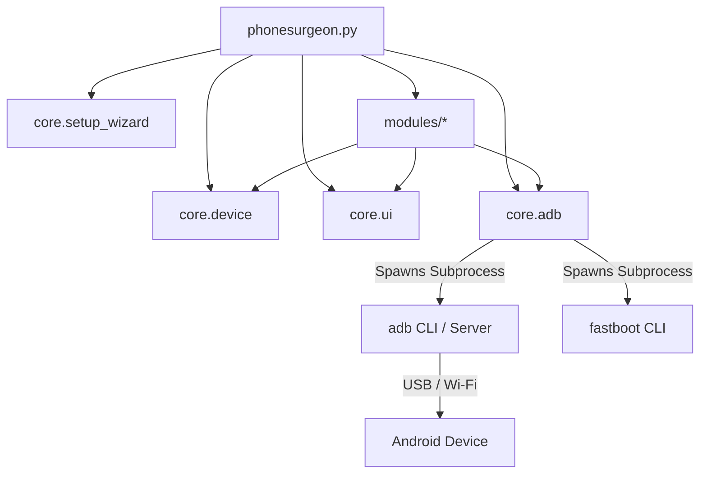

<!--
  PhoneSurgeon — Contributing Guide
  SPDX-License-Identifier: MIT
-->

# 🤝 Contributing to PhoneSurgeon

First off, thank you for considering contributing to **PhoneSurgeon**! 🏥✨

PhoneSurgeon is an open-source, menu-driven **Android Debug Bridge (ADB) & Fastboot Toolkit** built for Android developers, QA engineers, security researchers, and power users. Contributions from the community help make PhoneSurgeon more capable, robust, and accessible to everyone.

Whether you are fixing a bug, adding a new diagnostic module, improving documentation, or proposing features, we welcome your help.

---

## 📑 Table of Contents

- [Code of Conduct](#-code-of-conduct)
- [Design Philosophy](#-design-philosophy)
- [How to Contribute](#-how-to-contribute)
  - [Reporting Bugs](#reporting-bugs)
  - [Suggesting Enhancements](#suggesting-enhancements)
  - [Pull Request Workflow](#pull-request-workflow)
- [Development Setup](#-development-setup)
- [Project Architecture](#-project-architecture)
  - [Directory Layout](#directory-layout)
  - [Core Subsystem Overview](#core-subsystem-overview)
- [How to Add a New Module](#-how-to-add-a-new-module)
  - [Step 1: Create the Module File](#step-1-create-the-module-file)
  - [Step 2: Follow Architecture Conventions](#step-2-follow-architecture-conventions)
  - [Step 3: Register in `modules/__init__.py`](#step-3-register-in-modules__init__py)
  - [Step 4: Register in `phonesurgeon.py`](#step-4-register-in-phonesurgeonpy)
  - [Complete Working Example](#complete-working-example-template)
- [Coding Conventions & Rules](#-coding-conventions--rules)
- [Testing Guidelines](#-testing-guidelines)
- [Issue & PR Templates](#-issue--pr-templates)
- [Release & Commit Conventions](#-release--commit-conventions)

---

## 📜 Code of Conduct

We are committed to providing a friendly, safe, and welcoming environment for all contributors, regardless of experience level, gender, sexual orientation, disability, ethnicity, or religion.

### Our Standards
- **Be respectful and inclusive**: Welcome newcomers and encourage diverse viewpoints.
- **Provide constructive feedback**: Focus on code and architectural merits with empathy.
- **Collaborate with integrity**: Respect the time and contributions of fellow maintainers.

> [!NOTE]
> If you experience or witness unacceptable behavior, please report it to the project maintainers. All complaints will be reviewed and investigated promptly and impartially.

---

## 💡 Design Philosophy

Before writing code for PhoneSurgeon, keep these core principles in mind:

1. **Zero External Dependencies**:
   PhoneSurgeon runs exclusively on Python standard library modules (`os`, `sys`, `subprocess`, `shutil`, `urllib.request`, `json`, `time`, `re`, `datetime`, `pathlib`, `typing`). **Do not add packages requiring `pip install`.**
2. **Python 3.8+ Compatibility**:
   Code must run smoothly across Python 3.8, 3.9, 3.10, 3.11, 3.12, and 3.13.
3. **Cross-Platform Host Support**:
   Host operations must support Windows (PowerShell/CMD), macOS, and Linux without platform-specific crashes.
4. **Self-Healing & Auto-Setup**:
   If a tool (like ADB or Fastboot) is missing, PhoneSurgeon guides the user or auto-installs it through `core/setup_wizard.py`.
5. **Interactive & Intuitive UI**:
   Clean terminal banners, aligned tables, formatted key-value displays, and consistent color-coding via `core/ui.py`.

---

## 🔄 How to Contribute


### Reporting Bugs

Before creating a bug report, please check existing [GitHub Issues](https://github.com/yourusername/PhoneSurgeon/issues) to avoid duplicates.

When opening an issue, include:
- **PhoneSurgeon Version**: (e.g., `v2.0`)
- **Host OS**: (e.g., Windows 11 64-bit, Ubuntu 22.04 LTS, macOS Sonoma)
- **Python Version**: (e.g., `Python 3.11.4`)
- **Target Android Device & Version**: (e.g., Google Pixel 7, Android 14, API 34)
- **Detailed Reproduction Steps**: Exact menu options and inputs entered.
- **Log / Terminal Output**: Full stack trace or error message.

### Suggesting Enhancements

Feature requests are warmly welcomed! Please describe:
- The problem or workflow inefficiency you are trying to solve.
- The proposed ADB/Fastboot commands or logic to achieve the feature.
- A mockup of the terminal menu or output format.

### Pull Request Workflow

1. **Fork the repository** on GitHub:
   ```bash
   git clone https://github.com/<your-username>/PhoneSurgeon.git
   cd PhoneSurgeon
   ```

2. **Create a descriptive topic branch**:
   ```bash
   git checkout -b feature/battery-health-analyzer
   # or for bug fixes:
   git checkout -b fix/fastboot-reboot-timeout
   ```

3. **Implement your changes**:
   - Adhere to the code style and conventions described below.
   - Maintain strict Python standard library compliance.

4. **Verify syntax and compatibility**:
   ```bash
   python -m py_compile phonesurgeon.py core/*.py modules/*.py
   ```

5. **Commit your changes**:
   Use meaningful commit messages following Conventional Commits:
   ```bash
   git commit -m "feat(performance): add per-core CPU frequency monitor"
   ```

6. **Push to your fork and submit a Pull Request**:
   ```bash
   git push origin feature/battery-health-analyzer
   ```
   Open a PR against the `main` branch of the upstream repository.

---

## 🛠️ Development Setup

Getting started with PhoneSurgeon development takes less than 2 minutes because there are **no third-party dependencies** to compile or install.

### Prerequisites

| Component | Minimum Version | Notes |
|---|---|---|
| **Python** | `3.8+` | Tested through Python 3.13 |
| **ADB & Fastboot** | Platform Tools `r34+` | Auto-installed by `core/setup_wizard.py` if missing |
| **Android Device / Emulator** | Android 5.0+ (API 21+) | USB Debugging enabled |
| **Git** | `2.x+` | Version control |

### Running Locally

```bash
# 1. Clone your fork
git clone https://github.com/<your-username>/PhoneSurgeon.git
cd PhoneSurgeon

# 2. Launch the toolkit
python phonesurgeon.py
```

> [!TIP]
> You can test multi-device support by launching an Android Studio emulator alongside a physical device connected via USB.

---

## 📂 Project Architecture

### Directory Layout

```
PhoneSurgeon/
├── .github/                   # Issue & PR templates, workflows
├── core/                      # Core architectural framework
│   ├── __init__.py            # Core package descriptor
│   ├── adb.py                 # Central ADB/Fastboot process runner & singleton
│   ├── device.py              # Multi-device detection, picker & routing
│   ├── setup_wizard.py        # Auto-download & environment verification engine
│   └── ui.py                  # Terminal UI, ANSI styling, tables, menus, inputs
├── modules/                   # 16 domain-specific functional modules
│   ├── __init__.py            # Module registry
│   ├── app_manager.py         # Application lifecycle, permissions & APK tools
│   ├── automation.py          # Macro recorder, batch runner & scheduled scripts
│   ├── backup_restore.py      # App data, storage, contacts & SMS backup engines
│   ├── developer_options.py   # Developer settings & visual overlays toggle
│   ├── device_controls.py     # Power, reboot modes, wireless ADB & toggles
│   ├── device_info.py         # Comprehensive hardware, sensor & system reports
│   ├── fastboot_tools.py      # Bootloader unlock, flashing & partition management
│   ├── file_manager.py        # Host-device file transfers, browsing & checksums
│   ├── input_simulation.py    # Screen tap, swipe, gestures & key events
│   ├── logcat.py              # Filtered log viewer, crash dumps & live streaming
│   ├── network_tools.py       # Wi-Fi diagnostics, ping, DNS & port scanning
│   ├── performance.py         # Real-time CPU, GPU, memory, battery & frame stats
│   ├── screen_capture.py      # Screenshots, burst capture & HD screen recording
│   ├── security_audit.py      # Security posture, encryption & permission audit
│   ├── system_info.py         # Kernel, SELinux, partitions, services & mount points
│   └── ui_inspector.py        # Accessibility node dumps & UI hierarchy analyzer
├── captures/                  # Local folder for screenshots & recordings (gitignored)
├── backups/                   # Local folder for device backups (gitignored)
├── reports/                   # Exported diagnostic logs & audit reports (gitignored)
├── phonesurgeon.py            # Main entrypoint and primary menu loop
├── CONTRIBUTING.md            # Contribution guidelines (this file)
├── SECURITY.md                # Vulnerability disclosure & security policy
├── LICENSE                    # MIT License
└── README.md                  # Project overview & documentation
```

### Core Subsystem Overview



1. **`core/adb.py` (`ADB` class / singleton `adb`)**:
   - Manages child process execution via `subprocess.run()`.
   - Injects active device serial `-s <serial>` automatically.
   - Provides methods: `run()`, `run_shell()`, `run_interactive_shell()`, `run_fastboot()`, `list_devices()`, `getprop()`, `get_all_props()`.

2. **`core/ui.py`**:
   - ANSI color definitions (`Colors.GREEN`, `Colors.CYAN`, `Colors.YELLOW`, `Colors.RED`, `Colors.BOLD`, `Colors.RESET`).
   - Terminal layout: `clear()`, `print_banner()`, `print_sub_banner()`, `print_menu()`.
   - Interaction helpers: `get_choice()`, `confirm()`, `pause()`.
   - Feedback: `success()`, `error()`, `info()`, `warning()`, `header()`.
   - Data visualizers: `print_table()`, `print_kv()`, `progress_bar()`, `print_device_status()`.

3. **`core/device.py`**:
   - Handles multi-device environments.
   - `ensure_device()`: Guarantees a device is connected and selected before running commands.
   - `select_device()`: Prompts user to choose from multiple connected devices.
   - `get_device_label()`: Generates human-friendly display label (e.g. `Pixel 7 (R5CT12345)`).

4. **`core/setup_wizard.py`**:
   - Checks Python version requirement (3.8+).
   - Validates ADB and Fastboot availability.
   - Downloads official Google Android Platform Tools zip on-demand.
   - Manages configuration in `~/.phonesurgeon/config.json`.

---

## 🧩 How to Add a New Module

Adding a new diagnostic or management module to PhoneSurgeon follows a clear, predictable pattern.

### Step 1: Create the Module File

Create `modules/<your_module_name>.py` (use lowercase with underscores).

### Step 2: Follow Architecture Conventions

Your module must:
1. Include a top-level module docstring.
2. Import `adb` from `core.adb`, `ui` from `core`, and `ensure_device` from `core.device`.
3. Guard every device-dependent operation with `if not ensure_device(): return`.
4. Provide a `<module_name>_menu()` entrypoint containing a `while True:` loop.
5. Provide a Back/Exit option (`"0"`).
6. Call `ui.pause()` at the end of each menu iteration.

### Step 3: Register in `modules/__init__.py`

Expose the new menu function in `modules/__init__.py`:

```python
from modules.<your_module_name> import <your_module_name>_menu

__all__ = [
    # ... existing modules ...
    "<your_module_name>_menu",
]
```

### Step 4: Register in `phonesurgeon.py`

1. Import the new menu function at top of `phonesurgeon.py`:
   ```python
   from modules.<your_module_name> import <your_module_name>_menu
   ```
2. Add an entry to `MAIN_OPTIONS`:
   ```python
   MAIN_OPTIONS = [
       # ...
       "🔋  Battery Diagnostics",
       # ...
   ]
   ```
3. Map the menu index string in `MENU_HANDLERS`:
   ```python
   MENU_HANDLERS = {
       # ...
       "17": <your_module_name>_menu,
   }
   ```

---

### Complete Working Example Template

Below is a complete, copy-pasteable reference module illustrating all conventions:

```python
"""
modules/battery_diagnostics.py — Battery Diagnostics Module for PhoneSurgeon.

Provides real-time battery health analysis, charge cycle counts,
temperature diagnostics, and charging current monitoring.
"""

from typing import Dict, List, Tuple
from core.adb import adb
from core import ui
from core.device import ensure_device


# ─── Feature Actions ──────────────────────────────────────────────────────────

def show_battery_health():
    """Display real-time battery status and metrics."""
    if not ensure_device():
        return

    ui.print_sub_banner("Battery Health & Status", "🔋")
    ok, output = adb.run(["shell", "dumpsys", "battery"])

    if not ok:
        ui.error(f"Failed to query battery diagnostics: {output}")
        return

    # Parse key-value metrics
    data: Dict[str, str] = {}
    for line in output.splitlines():
        if ":" in line:
            key, val = line.split(":", 1)
            data[key.strip()] = val.strip()

    ui.header("Raw Battery Metrics:")
    ui.print_kv(data)
    ui.success("Battery metrics retrieved successfully.")


def toggle_dummy_charging(enable: bool):
    """Simulate AC charging state for development testing."""
    if not ensure_device():
        return

    if not ui.confirm(f"Set simulated charge status to {enable}?"):
        ui.info("Operation canceled.")
        return

    cmd = ["shell", "dumpsys", "battery", "set", "ac", "1" if enable else "0"]
    ok, err = adb.run(cmd)
    if ok:
        ui.success(f"Simulated charging status updated to: {enable}")
    else:
        ui.error(f"Failed to set battery simulation: {err}")


def reset_battery_mock():
    """Reset simulated battery state to hardware reality."""
    if not ensure_device():
        return

    ok, err = adb.run(["shell", "dumpsys", "battery", "reset"])
    if ok:
        ui.success("Battery simulation reset to physical hardware state.")
    else:
        ui.error(f"Failed to reset battery state: {err}")


# ─── Module Menu Loop ─────────────────────────────────────────────────────────

def battery_diagnostics_menu():
    """Interactive submenu loop for battery diagnostics."""
    options = [
        "View battery health & metrics",
        "Enable simulated AC charging",
        "Disable simulated AC charging",
        "Reset battery state to hardware",
    ]

    while True:
        ui.clear()
        ui.print_banner()
        ui.print_device_status(adb.serial)
        ui.print_menu("🔋 Battery Diagnostics", options, columns=1)

        choice = ui.get_choice("Select an option")

        if choice == "0":
            break
        elif choice == "1":
            show_battery_health()
        elif choice == "2":
            toggle_dummy_charging(True)
        elif choice == "3":
            toggle_dummy_charging(False)
        elif choice == "4":
            reset_battery_mock()
        else:
            ui.error("Invalid choice. Please select an option from the menu.")

        ui.pause()
```

---

## 📐 Coding Conventions & Rules

To keep the codebase maintainable and uniform, follow these mandatory rules:

### 1. Device Safety Verification
Always call `if not ensure_device(): return` at the top of any function that issues ADB or Fastboot commands. Never assume a device is already selected.

### 2. Standard UI Functions
Never use bare `print()` statements for notifications or status. Always use the built-in UI helpers:
- `ui.success("...")` for successful operations.
- `ui.error("...")` for failed commands or invalid states.
- `ui.warning("...")` for caution prompts or non-fatal anomalies.
- `ui.info("...")` for informational notices.
- `ui.confirm("...")` for user confirmation before disruptive actions.
- `ui.print_table(...)` for tabular datasets.
- `ui.print_kv(...)` for key-value listings.

### 3. No `match / case` Syntax
> [!IMPORTANT]
> **Do not use Python 3.10+ `match / case` syntax.** PhoneSurgeon supports Python 3.8+. Use standard `if / elif / else` structures or dictionary-based dispatch tables.

### 4. No External Dependencies
All functionality must be implemented using the **Python Standard Library only**. Do not import `requests`, `rich`, `click`, `colorama`, `paramiko`, etc.

### 5. Proper Subprocess Timeout Handling
Always pass a sensible `timeout` to `adb.run()` or `adb.run_shell()`:
- Quick properties / checks: `timeout=5` to `10`
- Dumps / package lists: `timeout=15` to `30`
- Large backups / pulls / recordings: `timeout=120` to `300` or stream interactively.

### 6. Cross-Platform File Paths
- Use `os.path.join()` or `pathlib.Path` for host filesystem paths.
- For remote Android paths, always use POSIX forward slashes (e.g. `/sdcard/Download/`).

### 7. Code Formatting & Typing
- Adhere to **PEP 8** standards (4-space indentation, snake_case for functions/variables, PascalCase for classes).
- Use type hints from the `typing` module (`List`, `Dict`, `Tuple`, `Optional`, `Union`) compatible with Python 3.8.
- Ensure all source files use `utf-8` encoding.

---

## 🧪 Testing Guidelines

Before opening a pull request, thoroughly test your changes across several scenarios:

### 1. Compilation & Syntax Verification
Ensure all files compile without syntax errors on Python 3.8:
```bash
python -m py_compile phonesurgeon.py core/*.py modules/*.py
```

### 2. Static Code Analysis / Linting
If you have `flake8` or `ruff` installed:
```bash
flake8 core modules phonesurgeon.py --max-line-length=120 --ignore=E501,W503
```

### 3. Physical Device & Emulator Testing
- Test with at least one **physical Android device** or **Android Virtual Device (AVD)**.
- Test menu navigation, invalid choice inputs, and back navigation (`0`).
- Test with **no device connected** to verify graceful error handling.
- Test with **multiple devices connected** to verify device picker behavior.
- Test with `Ctrl+C` interrupt to verify clean termination without unhandled stack traces.

### 4. Cross-Platform Validation (if possible)
- Verify behavior on Windows (cmd/PowerShell) and POSIX (macOS / Linux) terminals.

---

## 📋 Issue & PR Templates

### Bug Report Format

```markdown
### Environment
- **PhoneSurgeon Version**: v2.0
- **Host OS**: [e.g., Windows 11 / macOS 14 / Ubuntu 22.04]
- **Python Version**: [e.g., 3.11.2]
- **Android Device & OS**: [e.g., Samsung Galaxy S23, Android 14]

### Description
A clear and concise description of the bug.

### Steps to Reproduce
1. Start PhoneSurgeon (`python phonesurgeon.py`)
2. Select Menu option '...'
3. Enter input '...'
4. See error

### Expected Behavior
What you expected to happen.

### Actual Output & Stack Trace
```text
[Paste terminal output here]
```
```

### Pull Request Checklist

```markdown
### PR Checklist
- [ ] Code strictly uses Python standard library only (no new dependencies).
- [ ] Code is compatible with Python 3.8+ (no `match/case` syntax).
- [ ] Device operations include `if not ensure_device(): return`.
- [ ] UI feedback utilizes `core/ui.py` functions (`ui.success`, `ui.error`, etc.).
- [ ] Passed compilation check (`python -m py_compile ...`).
- [ ] Tested manually against a connected Android device or emulator.
- [ ] Submenu includes a working exit/back option (`0`).
```

---

## 🏷️ Release & Commit Conventions

We follow [Conventional Commits](https://www.conventionalcommits.org/):

| Prefix | Meaning | Example |
|---|---|---|
| `feat:` | A new feature or module | `feat(network): add DNS latency benchmark tool` |
| `fix:` | A bug fix | `fix(fastboot): handle empty partition table gracefully` |
| `docs:` | Documentation changes | `docs: add battery diagnostics guide to CONTRIBUTING.md` |
| `refactor:` | Code changes that neither fix bugs nor add features | `refactor(ui): optimize table width calculation` |
| `perf:` | Performance improvements | `perf(logcat): buffer streamed logcat output in chunks` |
| `chore:` | Build, maintenance, or repo tooling changes | `chore: update platform-tools auto-download URLs` |

---

<p align="center">
  <b>Thank you for helping make PhoneSurgeon the best Android toolkit in the open-source ecosystem! 🏥🚀</b>
</p>
