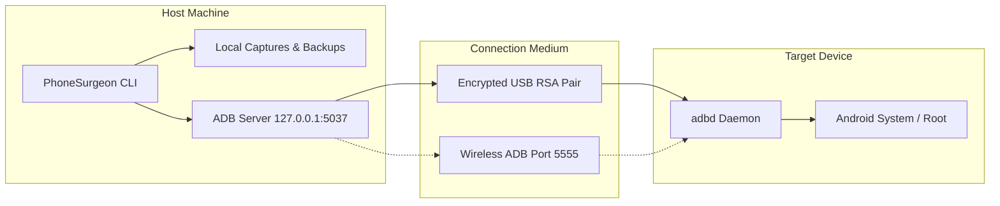

<!--
  PhoneSurgeon — Security Policy & Disclosure Guidelines
  SPDX-License-Identifier: MIT
-->

# 🔒 Security Policy

The **PhoneSurgeon** team takes software security, user privacy, and responsible device management seriously. This document outlines our supported versions, vulnerability reporting process, threat model, security considerations, and privacy guarantees.

---

## 📑 Table of Contents

- [Supported Versions](#-supported-versions)
- [Reporting a Vulnerability](#-reporting-a-vulnerability)
  - [Reporting Procedure](#reporting-procedure)
  - [What to Include in Your Report](#what-to-include-in-your-report)
  - [Our Response Commitments](#our-response-commitments)
  - [Recognition & Hall of Fame](#recognition--hall-of-fame)
- [Security Considerations & Threat Model](#-security-considerations--threat-model)
  - [1. ADB Access Privileges & Authority](#1-adb-access-privileges--authority)
  - [2. Wireless ADB & Local Network Risks](#2-wireless-adb--local-network-risks)
  - [3. Sensitive Data Handling & Local Storage](#3-sensitive-data-handling--local-storage)
  - [4. Dangerous Operations & Bootloader Modifications](#4-dangerous-operations--bootloader-modifications)
  - [5. Subprocess Execution & Injection Prevention](#5-subprocess-execution--injection-prevention)
- [What PhoneSurgeon DOES and Does NOT Do](#-what-phonesurgeon-does-and-does-not-do)
- [Disclaimer & Responsible Use Policy](#-disclaimer--responsible-use-policy)
- [Privacy Statement](#-privacy-statement)

---

## 🛡️ Supported Versions

We actively provide security updates and patches for the following versions of PhoneSurgeon:

| Version | Supported | Security Patch Support | Status |
|---|:---:|---|---|
| **2.x** (Current) | ✅ | Active security and bug fix updates | Current Release |
| **1.x** | ❌ | End of Life (EOL) — Upgrade to 2.x | Deprecated |
| **< 1.0** (Pre-release) | ❌ | Unsupported | End of Life |

> [!IMPORTANT]
> Users are strongly encouraged to always run the latest release on the `main` branch to ensure they have the latest security mitigations and platform-tools compatibility fixes.

---

## 🚨 Reporting a Vulnerability

We deeply appreciate the efforts of security researchers and community members who practice responsible disclosure.

### Reporting Procedure

If you discover a security vulnerability or potential exploit in PhoneSurgeon, **please do NOT create a public GitHub issue or discussion.**

Instead, report the issue via one of the following private channels:

1. **GitHub Private Security Advisory (Preferred)**:
   Navigate to the repository's **Security** tab and click **"Report a vulnerability"** to open a private advisory draft.
2. **Direct Security Email**:
   Send an encrypted or plain email to:
   ```text
   crimsonkix@gmail.com
   ```
   *(Subject line format: `[SECURITY] Vulnerability in <Module/Component>`)*

### What to Include in Your Report

To help us investigate and reproduce the issue quickly, please include:
- **Type of vulnerability**: (e.g., Command injection, host path traversal, insecure temporary file creation, privilege escalation).
- **Affected component(s)**: Specific core file (`core/adb.py`, `core/setup_wizard.py`) or module (`modules/file_manager.py`, etc.).
- **Proof-of-Concept (PoC)**: Minimal, step-by-step reproduction instructions or a test script.
- **Impact assessment**: What an attacker or malicious script could achieve.
- **Suggested mitigation** (if known).

### Our Response Commitments

| Milestone | Target Response Time |
|---|---|
| **Initial Acknowledgment** | Within **48 hours** of receiving your report |
| **Triage & Severity Assessment** | Within **5 business days** |
| **Patch & Release Window** | Critical: **7–14 days** • Moderate/Low: **30 days** |
| **Public Disclosure** | Coordinated disclosure once patched release is published |

### Recognition & Hall of Fame

If you discover a valid vulnerability and follow responsible disclosure practices:
- We will publicly credit you in our Release Notes and Security Hall of Fame (unless you prefer anonymity).
- We will collaborate transparently with you throughout the remediation cycle.

---

## 🔍 Security Considerations & Threat Model

PhoneSurgeon operates as a command-line interface that orchestrates Google's official Android SDK Platform Tools (`adb` and `fastboot`). When using PhoneSurgeon, keep the following security considerations in mind:



### 1. ADB Access Privileges & Authority

- **Authorized RSA Keypairs**: Android requires explicit user authorization on the physical device screen before ADB commands are accepted. Never accept an RSA fingerprint prompt on a physical device from an untrusted computer.
- **Shell vs Root Privileges**: Standard ADB shell runs under the `shell` UID (`2000`), which possesses extensive permissions (reading logs, managing apps, simulating input, pulling public files), but cannot modify system partitions on production devices. If your device is rooted or running a `userdebug` build, commands execute with elevated capabilities (`UID 0`). PhoneSurgeon makes no modifications to system files unless explicitly directed in fastboot or root-enabled submenus.

### 2. Wireless ADB & Local Network Risks

> [!WARNING]
> Enabling Wireless ADB (`adb tcpip 5555`) opens an unauthenticated port on standard Android versions prior to Android 11. Any device on the same local network (e.g., public Wi-Fi) could potentially connect to your device if they know its IP address.
>
> **Best Practice:**
> - Only enable Wireless ADB on secure, trusted private Wi-Fi networks.
> - Always disable TCP/IP mode or disconnect after testing sessions (`adb usb`).

### 3. Sensitive Data Handling & Local Storage

PhoneSurgeon provides tools for extracting diagnostics, contacts, SMS backups, logcat streams, screenshots, and screen recordings:
- **Local Artifacts**: All extracted files are stored strictly on the host computer within your local workspace folders (`captures/`, `backups/`, `reports/`).
- **PII Protection**: System logs and dumps may contain sensitive personally identifiable information (e.g., phone numbers, email addresses, notification previews, location coordinates). Do not publish raw logs or backups to public repositories.
- **Git Protection**: PhoneSurgeon includes `.gitignore` rules that prevent `captures/`, `backups/`, and `reports/` directories from ever being committed into Git tracking.

### 4. Dangerous Operations & Bootloader Modifications

> [!CAUTION]
> High-risk operations (such as OEM Bootloader Unlocking, Fastboot partition flashing, and partition wiping) carry inherent risks of data loss or device bricking.
>
> - **Unlocking the Bootloader** automatically wipes user data on modern Android devices (factory reset).
> - **Flashing incorrect images** (e.g. incompatible boot, recovery, or vendor images) can render hardware unbootable.
> - PhoneSurgeon includes explicit confirmation prompts (`ui.confirm()`) before executing destructive actions, but the final responsibility rests with the operator.

### 5. Subprocess Execution & Injection Prevention

- PhoneSurgeon invokes commands via Python's `subprocess.run()` using structured argument lists (`cmd = ["adb", "-s", target, ...]`) rather than shell-expanded strings whenever possible.
- This architecture isolates command execution from host shell injection vectors.
- When contributing code, developers must never pass unsanitized user strings into `shell=True` subprocess calls.

---

## ⚖️ What PhoneSurgeon DOES and Does NOT Do

To maintain transparency and ethical clarity, the table below defines the explicit functional boundaries of this project:

| Feature / Behavior | PhoneSurgeon Status | Explanation |
|---|:---:|---|
| **Official ADB/Fastboot Orchestration** | ✅ **DOES** | Wraps legitimate Google Platform Tools commands in an ergonomic, menu-driven CLI. |
| **Developer & QA Diagnostics** | ✅ **DOES** | Collects hardware status, thermal info, battery stats, system properties, and logcat logs. |
| **Application & File Lifecycle Management** | ✅ **DOES** | Installs/uninstalls APKs, pushes/pulls files, and inspects installed packages. |
| **Local Automated Testing & Macros** | ✅ **DOES** | Replays input sequences, taps, swipes, and batch commands locally for automated testing. |
| **Local Offline Execution** | ✅ **DOES** | Operates 100% locally on the host machine with zero cloud dependencies. |
| **Bypass Google Factory Reset Protection (FRP)** | ❌ **DOES NOT** | Does not contain exploits or bypasses for Google FRP or cloud locks. |
| **Crack Lockscreen Passwords / PINs** | ❌ **DOES NOT** | Does not perform brute-force attacks or attempt lockscreen credential theft. |
| **Exploit Kernel / Zero-Day Vulnerabilities** | ❌ **DOES NOT** | Does not package exploits or root kits designed to breach Android sandbox security. |
| **Sideload Malware, Spyware, or Backdoors** | ❌ **DOES NOT** | Contains no obfuscated binaries, keyloggers, or background surveillance agents. |
| **Collect Telemetry or User Data** | ❌ **DOES NOT** | Transmits zero analytics, tracking data, or device serial numbers to any third-party. |

---

## 📜 Disclaimer & Responsible Use Policy

PhoneSurgeon is developed strictly for **authorized educational, diagnostic, software development, quality assurance, and security research purposes**.

### Permitted Use:
- On personal devices that you own and control.
- On organization-owned test devices with explicit written authorization from the device owner or employer.
- In controlled lab environments and virtualized emulators for development and testing.

### Prohibited Use:
- Unauthorized access, data extraction, or modification of devices belonging to third parties without consent.
- Any activity that violates applicable local, national, or international computer fraud and abuse laws.

> [!IMPORTANT]
> The authors and maintainers of PhoneSurgeon assume **no liability and are not responsible for any misuse, data loss, device damage, or legal consequences** resulting from the use of this software. Refer to the [LICENSE](LICENSE) (MIT) for full legal terms.

---

## 🔏 Privacy Statement

Your data and privacy are paramount. PhoneSurgeon adheres to a strict, uncompromising privacy standard:

### 1. Zero Telemetry & Zero Analytics
- PhoneSurgeon contains **no telemetry tracking, no analytics SDKs, and no tracking pixels**.
- There are no telemetry pings sent on startup, execution, or exit.

### 2. 100% Local & Offline Operation
- All operations, menu parsing, command execution, and report generation occur strictly on your local machine.
- PhoneSurgeon does not require an active internet connection to function.

### 3. Verified Official Google CDN Auto-Download
- The only network activity initiated by PhoneSurgeon occurs when ADB is not detected on your host system and you **explicitly consent** to let the setup wizard download Android SDK Platform Tools.
- In this case, files are fetched directly from **Google's verified official CDN endpoints**:
  - Windows: `https://dl.google.com/android/repository/platform-tools-latest-windows.zip`
  - macOS: `https://dl.google.com/android/repository/platform-tools-latest-darwin.zip`
  - Linux: `https://dl.google.com/android/repository/platform-tools-latest-linux.zip`
- Downloads use HTTPS directly with no third-party proxies, analytics, or intermediaries.

### 4. No Remote Data Transmission
- No device serial numbers, IMEI/MAC addresses, package names, logs, or user files are ever sent across the network.
- Everything remains on your device and your host computer.

---

<p align="center">
  <b>PhoneSurgeon — Transparent, Secure, and Private Android Management. 🏥🔒</b>
</p>
