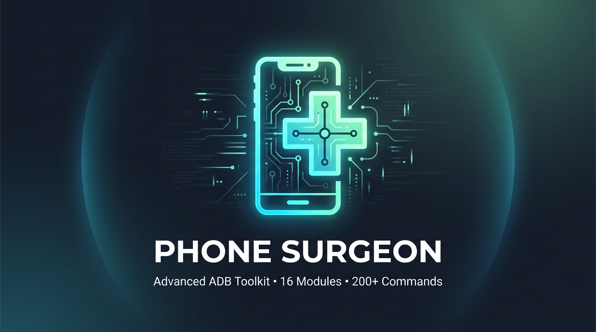

# 🏥 PhoneSurgeon — Complete User & Reference Guide

<p align="center">
  
</p>

Welcome to the comprehensive user guide for **PhoneSurgeon** — the advanced, interactive Android Debug Bridge (ADB) & Fastboot toolkit designed for Android developers, QA testers, security researchers, and power users.

PhoneSurgeon wraps over **200+ ADB and Fastboot commands** across **16 specialized modules** into an elegant, menu-driven command-line interface with **zero external dependencies** and an **automatic prerequisite setup wizard**.

---

## 📑 Table of Contents

- [🚀 Installation & Quick Start](#-installation--quick-start)
- [🧙 How the Auto-Setup Wizard Works](#-how-the-auto-setup-wizard-works)
- [🧭 Navigating the Menu System](#-navigating-the-menu-system)
- [🔌 Multi-Device Management](#-multi-device-management)
- [📦 Module-by-Module In-Depth Guide](#-module-by-module-in-depth-guide)
  - [1. 📱 Device Information](#1--device-information)
  - [2. 📦 App Manager](#2--app-manager)
  - [3. 📁 File Manager](#3--file-manager)
  - [4. 📸 Screen Capture & Recording](#4--screen-capture--recording)
  - [5. 📋 Logcat Viewer & Diagnostics](#5--logcat-viewer--diagnostics)
  - [6. 💾 Backup & Restore](#6--backup--restore)
  - [7. 🔧 Device Controls & Settings](#7--device-controls--settings)
  - [8. 📊 Performance Monitor](#8--performance-monitor)
  - [9. 🌐 Network Tools & Diagnostics](#9--network-tools--diagnostics)
  - [10. 👆 Input & Touch Simulation](#10--input--touch-simulation)
  - [11. 🔍 UI Hierarchy Inspector](#11--ui-hierarchy-inspector)
  - [12. ⚙️ Developer Options & Tweaks](#12--developer-options--tweaks)
  - [13. ⚡ Fastboot & Bootloader Tools](#13--fastboot--bootloader-tools)
  - [14. 🖥️ System Internals & Diagnostics](#14--system-internals--diagnostics)
  - [15. 🔒 Security Audit & Scorecard](#15--security-audit--scorecard)
  - [16. 🤖 Automation, Macros & Scripts](#16--automation-macros--scripts)
- [🎯 Practical Step-by-Step Workflows](#-practical-step-by-step-workflows)
  - [Workflow 1: Installing & Sideloading APKs](#workflow-1-installing--sideloading-apks)
  - [Workflow 2: Taking Screenshots & Screen Recordings](#workflow-2-taking-screenshots--screen-recordings)
  - [Workflow 3: Debugging Application Crashes & Logs](#workflow-3-debugging-application-crashes--logs)
  - [Workflow 4: Backing Up & Restoring Phone Data](#workflow-4-backing-up--restoring-phone-data)
  - [Workflow 5: Profiling Device Performance & RAM](#workflow-5-profiling-device-performance--ram)
  - [Workflow 6: Automating Repetitive Touch Tasks (Macros)](#workflow-6-automating-repetitive-touch-tasks-macros)
  - [Workflow 7: Auditing Phone Security & Permissions](#workflow-7-auditing-phone-security--permissions)
  - [Workflow 8: Flashing a Custom Recovery via Fastboot](#workflow-8-flashing-a-custom-recovery-via-fastboot)
- [💡 Pro Tips & Tricks](#-pro-tips--tricks)
- [🛠️ Troubleshooting & Problem Solving](#️-troubleshooting--problem-solving)
- [❓ Frequently Asked Questions (FAQ)](#-frequently-asked-questions-faq)

---

## 🚀 Installation & Quick Start

### 📋 Prerequisites

| Component | Minimum Version | Notes |
|---|---|---|
| **Python** | `3.8+` | Tested on Python 3.8 – 3.14 (CPython). Zero 3rd-party pip packages required! |
| **Operating System** | Windows 10/11, macOS 10.15+, Linux (Ubuntu/Debian/Arch/Fedora) | Fully cross-platform with native terminal ANSI color support |
| **Android Device** | Android 5.0 (Lollipop) up to Android 15+ | Phone, tablet, Wear OS, Android TV, or emulator |
| **USB Cable** | Data-capable USB cable | Ensure cable supports data transfer, not charge-only |

### 📥 1. Clone or Download

Clone the repository using Git or download the ZIP archive:

```bash
git clone https://github.com/yourusername/PhoneSurgeon.git
cd PhoneSurgeon
```

### ⚡ 2. Run PhoneSurgeon

Run the entry point script using Python:

```bash
# On Windows
python phonesurgeon.py

# On macOS / Linux
python3 phonesurgeon.py
```

> [!NOTE]
> **No `pip install` needed!** PhoneSurgeon is written in 100% standard library Python (`subprocess`, `urllib`, `json`, `os`, `shutil`, `re`, `pathlib`).

---

## 🧙 How the Auto-Setup Wizard Works

When you run PhoneSurgeon for the first time (or if ADB is missing from your system `PATH`), the built-in **Auto-Setup Wizard** runs automatically to prepare your environment.

```
    ╔══════════════════════════════════════════════════════╗
    ║                                                      ║
    ║       🏥  P H O N E   S U R G E O N  🏥             ║
    ║       ━━━━━━━━━━━━━━━━━━━━━━━━━━━━━━━━               ║
    ║            First-Time Setup Wizard                    ║
    ║                                                      ║
    ╚══════════════════════════════════════════════════════╝

  Checking prerequisites...

  [1/5] Checking Python version...
  ✓ Python 3.11 detected (minimum 3.8)

  [2/5] Checking ADB (Android Debug Bridge)...
  ✗ ADB not found on system PATH.

  ➤ Download & install ADB automatically? (y/n): y

  Downloading Android SDK Platform Tools...
  ℹ URL: https://dl.google.com/android/repository/platform-tools-latest-windows.zip
  ℹ Destination: C:\Users\Username\.phonesurgeon
  [██████████████████████████████] 100.0%
  ✓ Downloaded (13.2 MB)

  Extracting...
  ✓ Extracted successfully!
  ✓ ADB installed: C:\Users\Username\.phonesurgeon\platform-tools\adb.exe
  ✓ Version: Android Debug Bridge version 1.0.41 (35.0.2)

  [3/5] Checking Fastboot (optional)...
  ✓ Fastboot found: C:\Users\Username\.phonesurgeon\platform-tools\fastboot.exe

  [4/5] Starting ADB server...
  ✓ ADB server is running

  [5/5] Checking device connectivity...
  ✓ Connected devices: 1
    🔌 R5CT1234567

  ━━━━━━━━━━━━━━━━━━━━━━━━━━━━━━━━━━━━━━━━━━━━━━━━━━
  ✓ All checks passed! PhoneSurgeon is ready.

  Press Enter to launch PhoneSurgeon...
```

### ⚙️ What the Setup Wizard Does Behind the Scenes

1. **Python Check**: Verifies that your runtime is Python 3.8 or newer.
2. **ADB Detection & Auto-Download**:
   - Searches your system `PATH`.
   - If not found, prompts to automatically download official Google Android SDK Platform Tools for Windows, macOS, or Linux.
   - Extracts binaries into `~/.phonesurgeon/platform-tools/` and injects them into the runtime session `PATH`.
   - On macOS/Linux, automatically grants executable permissions (`chmod +x`).
3. **Fastboot Check**: Identifies whether `fastboot` is accessible for bootloader operations.
4. **ADB Server Daemon**: Starts the background `adb server` process if it is not already running.
5. **Driver & Device Check**: Probes for connected USB/WiFi devices and validates authorization state.
6. **State Persistence**: Writes status and tool paths to `~/.phonesurgeon/config.json` so subsequent startups load instantly via a quick check path!

> [!TIP]
> You can force the setup wizard to re-run at any time by choosing **Option 19 (`🏥 Re-run Setup Wizard`)** from the Main Menu.

---

## 🧭 Navigating the Menu System

PhoneSurgeon features a clean, dual-column interactive menu.

```
    ╔══════════════════════════════════════════════════════╗
    ║                                                      ║
    ║       🏥  P H O N E   S U R G E O N  🏥             ║
    ║       ━━━━━━━━━━━━━━━━━━━━━━━━━━━━━━━━               ║
    ║       Advanced Android Debug Bridge Toolkit           ║
    ║       v2.0  •  16 Modules  •  200+ Commands          ║
    ║                                                      ║
    ╚══════════════════════════════════════════════════════╝

  🔌 Active device: R5CT1234567 (Galaxy S23)

  ── Main Menu ──

  [ 1] 📱  Device Information          [10] 👆  Input Simulation
  [ 2] 📦  App Manager                 [11] 🔍  UI Inspector
  [ 3] 📁  File Manager                [12] ⚙️   Developer Options
  [ 4] 📸  Screen Capture              [13] ⚡  Fastboot Tools
  [ 5] 📋  Logcat Viewer               [14] 🖥️   System Info
  [ 6] 💾  Backup & Restore            [15] 🔒  Security Audit
  [ 7] 🔧  Device Controls             [16] 🤖  Automation & Scripts
  [ 8] 📊  Performance Monitor         [17] ─────────────────────
  [ 9] 🌐  Network Tools               [18] 🔄  Switch Device
                                       [19] 🏥  Re-run Setup Wizard

  [ 0] ← Back / Exit

  ➤ Select option: 
```

### 💡 General Navigation Rules
- **Enter a Number**: Type the number of the option you wish to run and press `Enter`.
- **Exit or Go Back**: Press `0` and hit `Enter` from any submenu to return to the previous screen, or from the Main Menu to exit cleanly.
- **Cancel / Interrupt**: Press `Ctrl + C` at any prompt to cancel the active operation and return safely to the menu.
- **Header Status**: The line `🔌 Active device: <SERIAL> (<MODEL>)` at the top of every screen shows which device will receive your commands.

---

## 🔌 Multi-Device Management

Have multiple phones, tablets, or emulators connected at once? PhoneSurgeon includes native multi-device switching and automatic target routing using ADB's `-s <serial>` flag.

### 🔄 Selecting & Switching Devices

1. If only **one device** is connected on startup, PhoneSurgeon selects it automatically.
2. If **multiple devices** are connected on startup, or if you select **Option 18 (`🔄 Switch Device`)**, PhoneSurgeon presents a device selection table:

```
  ── Multiple devices detected: ──

  +-----+-------------------+--------+-----------------+-------------+
  |   # | Serial            | State  | Model           | Device      |
  +-----+-------------------+--------+-----------------+-------------+
  |   1 | R5CT1234567       | device | Galaxy S23      | kalama      |
  |   2 | emulator-5554     | device | Pixel 7 Pro     | cheetah     |
  |   3 | 192.168.1.105:5555| device | OnePlus 11      | salami      |
  +-----+-------------------+--------+-----------------+-------------+

  ➤ Select device number: 2
  ✓ Selected: emulator-5554 (Pixel 7 Pro)
```

### 📶 Wireless ADB (TCP/IP) Connection

Cut the cord and manage your phone over Wi-Fi without cables:

1. Connect your phone via USB cable once.
2. Go to **Option 7 (`🔧 Device Controls`)** ➔ **Option 5 (`Enable WiFi ADB (tcpip 5555)`)**.
3. Unplug the USB cable.
4. From Device Controls, select **Option 6 (`Connect via WiFi (IP:port)`)** and enter your phone's Wi-Fi IP (e.g. `192.168.1.50:5555`).
5. Select **Option 18 (`Switch Device`)** to set the wireless endpoint as your active target!

---

## 📦 Module-by-Module In-Depth Guide

Below is the complete reference for all 16 modules included in PhoneSurgeon.

---

### 1. 📱 Device Information
*File: `modules/device_info.py` • 1,122 lines • 13 features*

Deep hardware, firmware, battery, display, and telephony profiling.

| # | Option | Description |
|---|---|---|
| 1 | **List connected devices** | Detailed overview of all connected USB & Wi-Fi devices |
| 2 | **Device model & build** | Model, brand, board, manufacturer, Android OS version, SDK level |
| 3 | **Hardware info** | Chipset/SoC, CPU cores, architecture, GPU renderer, RAM capacity |
| 4 | **Battery status** | Real-time level (%), health, voltage (mV), temperature (°C), charging tech |
| 5 | **Screen info** | Resolution (e.g. 1080x2340), density (DPI), refresh rate (Hz), orientation |
| 6 | **Network info** | Local Wi-Fi IP, MAC address, Wi-Fi SSID, link speed |
| 7 | **SIM / telephony info** | Network operator, SIM state, phone type, roaming status |
| 8 | **Sensor list** | Complete inventory of hardware sensors (accelerometer, gyro, light, baro) |
| 9 | **Thermal zones** | Temperature readout across all thermal sensors (CPU, GPU, battery, skin) |
| 10 | **Build properties dump** | Searchable inspection of all `getprop` system properties with file export |
| 11 | **Storage overview** | Partition breakdown (`/data`, `/system`, `/sdcard`, external SD) |
| 12 | **Feature list** | System feature flags (NFC, camera flash, biometric, BLE, etc.) |
| 13 | **Export full report** | Generates a diagnostic `.txt` report containing all system properties |

```
  ── Battery Status ──
  Level:          87%
  Status:         Charging (AC Fast Charger)
  Health:         Good
  Voltage:        4,215 mV
  Temperature:    31.4 °C (Normal)
  Technology:     Li-poly
```

---

### 2. 📦 App Manager
*File: `modules/app_manager.py` • 916 lines • 16 features*

Comprehensive package lifecycle management, permission auditing, and APK extraction.

| # | Option | Description |
|---|---|---|
| 1 | **Install APK** | Sideload an APK with flags: replace (`-r`), downgrade (`-d`), grant permissions (`-g`) |
| 2 | **Install multiple APKs** | Batch install all `.apk` files inside a local folder |
| 3 | **Uninstall app** | Remove an app with option to preserve app data cache (`-k`) |
| 4 | **List all installed apps** | Paginated view of every package on the device |
| 5 | **List third-party apps** | Filter to show only user-installed applications (`pm list packages -3`) |
| 6 | **List system apps** | View OEM and Android pre-installed system packages (`pm list packages -s`) |
| 7 | **Search installed apps** | Search by keyword (e.g. `whatsapp`, `camera`) with quick actions menu |
| 8 | **Launch app** | Launch any app directly by its package name |
| 9 | **Force stop app** | Immediately kill an app's background processes and services |
| 10 | **Clear app data & cache** | Reset an app to its clean-install state (`pm clear`) |
| 11 | **View app permissions** | Inspect granted runtime and install-time permissions |
| 12 | **Get APK filesystem path** | Locate the exact path of the base APK on `/data/app/` |
| 13 | **Extract / pull APK** | Download the installed APK file from the device to your PC |
| 14 | **Disable / enable app** | Freeze bloatware or unfreeze disabled applications (`pm disable-user`) |
| 15 | **App version metadata** | Version code, version name, target SDK, install timestamp |
| 16 | **Open in Settings UI** | Open the Android system App Info settings page for the target app |

---

### 3. 📁 File Manager
*File: `modules/file_manager.py` • 978 lines • 15 features*

Full bidirectional file synchronization, directory navigation, and file manipulation.

| # | Option | Description |
|---|---|---|
| 1 | **Push file to device** | Upload a local PC file to any accessible phone path |
| 2 | **Pull file from device** | Download a file from the device to your local PC |
| 3 | **Push entire folder** | Recursively transfer a whole folder to the phone |
| 4 | **Pull entire folder** | Recursively download a phone folder (e.g. `/sdcard/DCIM/`) to PC |
| 5 | **List directory contents** | Detailed file listing (`ls -la`) with permissions, size, dates |
| 6 | **Search files by name** | Find files matching wildcard patterns (`*.pdf`, `*.mp4`) |
| 7 | **Disk & storage usage** | Check free/used disk space (`df -h` and `du -sh`) |
| 8 | **Create directory** | Create single or nested directories (`mkdir -p`) |
| 9 | **Delete file / folder** | Remove files or directories (`rm -rf`) |
| 10 | **Move / rename** | Relocate or rename files on device (`mv`) |
| 11 | **View file contents** | View file text (`cat`, `head -n`, `tail -n`) directly in terminal |
| 12 | **Check file info** | View exact permissions, UID/GID owner, size, and timestamps |
| 13 | **Change permissions** | Modify POSIX file permissions (`chmod 755`, `chmod 644`) |
| 14 | **Verify checksum** | Calculate MD5 or SHA256 checksums to verify file integrity |
| 15 | **Create empty file** | Touch a new zero-byte file on the device filesystem |

---

### 4. 📸 Screen Capture & Recording
*File: `modules/screen_capture.py` • 685 lines • 11 features*

High-resolution screenshots and custom screen video recording.

| # | Option | Description |
|---|---|---|
| 1 | **Take single screenshot** | Captures display immediately and saves as a timestamped PNG |
| 2 | **Take burst screenshots** | Captures a series of screenshots with configurable intervals |
| 3 | **Record screen (10s default)** | Quick 10-second MP4 recording pulled directly to your PC |
| 4 | **Record screen (custom time)** | Record up to 180 seconds with automatic timer |
| 5 | **Record with custom bitrate** | Adjust bitrate (e.g. 4 Mbps for small size, 16 Mbps for high fidelity) |
| 6 | **Record custom resolution** | Scale video resolution (e.g. `1280x720` or `1920x1080`) |
| 7 | **Multi-display screenshot** | Capture secondary or virtual displays by display ID |
| 8 | **Open capture folder** | Opens the local directory containing your saved media in OS Explorer/Finder |
| 9 | **Advanced recording** | Combines touches overlay (`--show-touches`), custom bitrate, and duration |
| 10 | **View capture history** | Lists all captured media files with dimensions and file sizes |
| 11 | **Clean temp files** | Purges any residual video or image files from `/sdcard/` |

---

### 5. 📋 Logcat Viewer & Diagnostics
*File: `modules/logcat.py` • 891 lines • 13 features*

Real-time and historical Android system log analysis.

| # | Option | Description |
|---|---|---|
| 1 | **View recent logs** | Display the last 100 lines of system logs |
| 2 | **Filter by priority** | Filter by level: `V` (Verbose), `D` (Debug), `I` (Info), `W` (Warn), `E` (Error), `F` (Fatal) |
| 3 | **Filter by tag** | Filter by Android log tag (e.g. `ActivityManager`, `OkHttp`, `Unity`) |
| 4 | **Filter by PID / Package** | View logs originating strictly from a specific process or app |
| 5 | **Search by regex/keyword** | Regex-powered text search across the log stream |
| 6 | **View crash logs** | Filters for fatal unhandled exceptions (`AndroidRuntime`, `FATAL EXCEPTION`) |
| 7 | **View ANR logs** | Reads application not responding stack traces from `/data/anr/` |
| 8 | **Clear logcat buffer** | Clears the ring buffers (`adb logcat -c`) |
| 9 | **Save logcat to file** | Exports the entire logcat buffer to a timestamped `.log` file |
| 10 | **Buffer size settings** | View and resize logcat buffers (main, system, crash, radio) |
| 11 | **View kernel logs (dmesg)** | Low-level Linux kernel messages and boot logs |
| 12 | **View event logs** | System event buffer logs (`adb logcat -b events`) |
| 13 | **Live logcat stream** | Real-time color-coded streaming log viewer |

---

### 6. 💾 Backup & Restore
*File: `modules/backup_restore.py` • 889 lines • 11 features*

Full device backups, individual app archives, contacts, and messaging export.

| # | Option | Description |
|---|---|---|
| 1 | **Full device backup** | Generates an Android `.ab` archive of apps, data, and shared storage |
| 2 | **Backup specific app** | Create an isolated backup archive for a single selected package |
| 3 | **Backup data only** | Backup app private databases and preferences without the APK files |
| 4 | **Backup shared storage** | Backs up `/sdcard/` user media and documents |
| 5 | **Restore from backup** | Pushes and restores an `.ab` archive back onto the phone |
| 6 | **Backup contacts** | Dumps contacts via Android content provider to standard vCard (`.vcf`) & CSV |
| 7 | **List available backups** | Scans local storage for existing `.ab`, `.vcf`, and `.csv` backups |
| 8 | **Encryption guide** | Guide on setting desktop backup passwords and Android 12+ policies |
| 9 | **Backup SMS & Call logs** | Queries telephony content providers to export text messages and call logs |
| 10 | **Export package manifest** | Generates a clean text file listing all installed package names |
| 11 | **Inspect .ab backup file** | Checks headers and validates compression/encryption of backup archives |

---

### 7. 🔧 Device Controls & Settings
*File: `modules/device_controls.py` • 936 lines • 16 features*

Hardware state manipulation, remote reboots, and power settings.

| # | Option | Description |
|---|---|---|
| 1 | **Reboot device** | Clean normal system restart (`adb reboot`) |
| 2 | **Reboot to recovery** | Reboots into TWRP, OrangeFox, or stock recovery |
| 3 | **Reboot to bootloader** | Reboots into Fastboot / Download mode |
| 4 | **Soft reboot (hot restart)** | Restarts the Zygote process without full hardware reboot |
| 5 | **Enable WiFi ADB** | Starts TCP/IP listening daemon on port 5555 |
| 6 | **Connect via WiFi** | Connects to a target IP address over your local network |
| 7 | **Disconnect WiFi device** | Gracefully disconnects a wireless ADB session |
| 8 | **Open interactive shell** | Drops directly into an interactive Android Linux shell (`sh` / `toybox`) |
| 9 | **Send text input** | Types a text string remotely onto the focused input field |
| 10 | **Send key event** | Injects Android keycodes (Back, Home, Power, Volume, Enter, etc.) |
| 11 | **Toggle screen on/off** | Wakes up or locks the display |
| 12 | **Set screen brightness** | Adjusts backlight value (0 to 255) |
| 13 | **Set screen timeout** | Modifies sleep timer (15s, 30s, 1m, 5m, 30m, never) |
| 14 | **Toggle airplane mode** | Switches radio hardware on or off |
| 15 | **Set screen rotation** | Locks portrait, landscape, or enables auto-rotation |
| 16 | **Keep screen awake** | Forces the screen to stay awake indefinitely while connected |

---

### 8. 📊 Performance Monitor
*File: `modules/performance.py` • 899 lines • 12 features*

Real-time CPU, RAM, GPU, and process metrics.

| # | Option | Description |
|---|---|---|
| 1 | **CPU information** | Core architecture, online core count, scaling governors, frequencies |
| 2 | **Memory (RAM) stats** | Total RAM, free, cached, available, zRAM swap stats (`/proc/meminfo`) |
| 3 | **Storage usage (df -h)** | Partition size, used percentage, mount mount points |
| 4 | **Detailed battery stats** | Discharge rates, voltage curve, power consumption per subsystem |
| 5 | **GPU info & renderer** | OpenGL ES version, GPU vendor, Vulkan API capabilities |
| 6 | **Running processes** | Top 25 active Linux processes sorted by memory usage |
| 7 | **App memory profiling** | Detailed PSS, RSS, Private Dirty, Native Heap, and Dalvik Heap breakdown |
| 8 | **CPU usage by app** | Real-time snapshot of CPU load per application |
| 9 | **Disk I/O stats** | Read/write sector rates and I/O wait times (`/proc/diskstats`) |
| 10 | **Network throughput stats** | Rx/Tx byte counts per interface (`/proc/net/dev`) |
| 11 | **Frame rendering stats** | Jank detection, frame render times, 90th/95th/99th percentile stats |
| 12 | **System uptime** | Device uptime, idle time, and deep sleep percentage |

```
  ── App Memory Profile: com.example.myapp ──
  +------------------+-----------+---------------+
  | Category         | PSS (KB)  | Private Dirty |
  +------------------+-----------+---------------+
  | Native Heap      | 34,812 KB | 34,600 KB     |
  | Dalvik (Java)    | 22,410 KB | 21,900 KB     |
  | Code & Assets    | 12,104 KB | 4,200 KB      |
  | Stack & Graphics | 18,340 KB | 18,340 KB     |
  | TOTAL PSS        | 87,666 KB | 79,040 KB     |
  +------------------+-----------+---------------+
```

---

### 9. 🌐 Network Tools & Diagnostics
*File: `modules/network_tools.py` • 1,312 lines • 14 features*

Network socket inspection, packet routing, Wi-Fi auditing, and diagnostics scorecards.

| # | Option | Description |
|---|---|---|
| 1 | **Wi-Fi information** | SSID, BSSID, RSSI signal strength (dBm), Wi-Fi frequency band (2.4/5/6 GHz) |
| 2 | **Wi-Fi IP & interface** | Local IPv4/IPv6 addresses, subnet mask, gateway, broadcast address |
| 3 | **Cellular / Mobile data** | Network operator, data connection state, LTE/5G RAT type, signal dBm |
| 4 | **Ping from device** | Sends ICMP ping packets from the phone to any remote hostname/IP |
| 5 | **DNS & Private DNS** | Shows active DNS servers and Android Private DNS (DoT) configuration |
| 6 | **Kernel routing table** | Inspects routing tables (`ip route` / `/proc/net/route`) |
| 7 | **Open ports (netstat)** | Lists all listening TCP and UDP network ports on the device |
| 8 | **Network interfaces** | Complete overview of all interfaces (`wlan0`, `rmnet_data0`, `lo`, `tun0`) |
| 9 | **Data usage & throughput** | Real-time download/upload speed calculator and historical byte counters |
| 10 | **HTTP / HTTPS test** | Validates web connectivity and TLS handshake directly from the device |
| 11 | **Saved Wi-Fi networks** | Lists saved Wi-Fi SSID profiles and security configurations |
| 12 | **Toggle Wi-Fi power** | Power cycles the Wi-Fi adapter (`svc wifi enable/disable`) |
| 13 | **Active connections** | Dumps live TCP socket connections and connected remote hosts |
| 14 | **Diagnostics scorecard** | Automated end-to-end network health check with Pass/Warn/Fail score |

---

### 10. 👆 Input & Touch Simulation
*File: `modules/input_simulation.py` • 939 lines • 13 features*

Programmatic touch events, coordinate tapping, hardware key emulation, and gestures.

| # | Option | Description |
|---|---|---|
| 1 | **Tap at coordinates** | Injects a precise touch tap at specified `(X, Y)` screen pixels |
| 2 | **Long press** | Simulates a prolonged press at `(X, Y)` with custom hold duration in ms |
| 3 | **Custom swipe** | Performs a smooth swipe from `(X1, Y1)` to `(X2, Y2)` over duration `T` |
| 4 | **Swipe gestures** | Pre-programmed gestures: Scroll Up, Scroll Down, Fling, Swipe Left/Right |
| 5 | **Type text** | Injects alphanumeric text directly into active input fields |
| 6 | **Send key event** | Emulates hardware buttons (Home, Back, Menu, Volume, Power, Enter) |
| 7 | **Send key combinations** | Sends shortcuts like `Ctrl+A`, `Ctrl+C`, `Ctrl+V`, `Alt+Tab` |
| 8 | **Quick navigation** | Instant buttons for Home (3), Back (4), Recents (187), Power (26) |
| 9 | **Notification shade** | Expands or collapses the Android status notification shade |
| 10 | **Quick settings** | Expands or collapses the Android quick settings toggles panel |
| 11 | **Screenshot combo** | Triggers native hardware screenshot key combo (Power + Vol Down) |
| 12 | **Volume controls** | Step volume up/down, mute audio, or set exact volume index |
| 13 | **Media controls** | Play/Pause, Next Track, Previous Track, Fast-Forward, Stop |

---

### 11. 🔍 UI Hierarchy Inspector
*File: `modules/ui_inspector.py` • 1,211 lines • 12 features*

Layout tree inspection, active Activity analysis, and window hierarchy dumps.

| # | Option | Description |
|---|---|---|
| 1 | **Dump UI Hierarchy** | Dumps full XML element hierarchy (`uiautomator dump`) with view bounds |
| 2 | **Current Activity & Task** | Identifies top-most visible Activity, package, and backstack task ID |
| 3 | **Current Fragments** | Inspects active Fragment backstack inside the foreground app |
| 4 | **List recent activities** | Displays the full task stack history of recent apps |
| 5 | **Focused window info** | Technical metrics for the currently focused display window |
| 6 | **All active windows** | Lists all rendered windows, system alert overlays, and dialog popups |
| 7 | **App content providers** | Lists ContentProvider endpoints exposed by the active application |
| 8 | **View running services** | Identifies background, foreground, and bound services |
| 9 | **Accessibility subsystem** | Dumps accessibility tree and active screen reader nodes |
| 10 | **Display & cutout info** | Screen density, physical resolution, HDR capabilities, camera cutout notch |
| 11 | **View intent filters** | Inspects registered Activities, Broadcast Receivers, and Intent Filters |
| 12 | **WindowManager policy** | Dumps system UI flags, navigation bar state, and orientation policy |

---

### 12. ⚙️ Developer Options & Tweaks
*File: `modules/developer_options.py` • 675 lines • 16 features*

Instant developer toggles, rendering overlays, and SystemUI demo mode.

| # | Option | Description |
|---|---|---|
| 1 | **Show Layout Bounds** | Visually highlights view clip boundaries, margins, and padding |
| 2 | **GPU Overdraw** | Color-codes screen areas to visualize multi-pass rendering overdraw |
| 3 | **Window animation scale** | Adjusts window transition animations (0.0x, 0.5x, 1.0x, 2.0x, 5.0x) |
| 4 | **Transition animation scale**| Adjusts activity transition animation speeds |
| 5 | **Animator duration scale** | Adjusts ObjectAnimator and ViewPropertyAnimator timing |
| 6 | **Show Touches** | Renders visible white dots wherever touches occur on screen |
| 7 | **Pointer Location** | Displays coordinate crosshairs, touch pressure, and track lines |
| 8 | **StrictMode Visual Flash** | Flashes screen red when apps perform heavy I/O on the main UI thread |
| 9 | **Stay Awake Settings** | Toggles keeping screen on while plugged into USB or AC power |
| 10 | **Background process limit** | Enforces max background process slots (Standard, 0, 1, 2, 3, 4) |
| 11 | **WebView debugging** | Forces remote Chromium DevTools debugging for all WebViews |
| 12 | **Profile HWUI rendering** | Renders real-time frame render timing bars on screen |
| 13 | **Force 4x MSAA** | Forces 4x multisample anti-aliasing in OpenGL ES 2.0+ games/apps |
| 14 | **Settings overview** | Comprehensive status table of all Android developer flags |
| 15 | **Speed presets** | 1-click presets: `⚡ Lightning (0x)`, `🚀 Snappy (0.5x)`, `🐢 Slow-Mo (5x)` |
| 16 | **SystemUI Demo Mode** | Sets status bar to clean 12:00, 100% battery, max Wi-Fi for pristine screenshots |

---

### 13. ⚡ Fastboot & Bootloader Tools
*File: `modules/fastboot_tools.py` • 820 lines • 14 features*

Low-level bootloader communication, partition flashing, and OEM unlocking.

> [!CAUTION]
> Fastboot operations modify raw device partitions. Always double-check your image files and partition names before flashing!

| # | Option | Description |
|---|---|---|
| 1 | **Check Fastboot devices** | Detects devices connected in Fastboot / Bootloader mode |
| 2 | **Get all variables** | Queries complete bootloader variable list (`fastboot getvar all`) |
| 3 | **Get specific variable** | Reads variable (e.g. `unlocked`, `current-slot`, `version-bootloader`) |
| 4 | **Flash boot image** | Flashes kernel/ramdisk image (`fastboot flash boot boot.img`) |
| 5 | **Flash recovery image** | Flashes custom recovery (`fastboot flash recovery twrp.img`) |
| 6 | **Flash system image** | Flashes system OS partition image (`fastboot flash system system.img`) |
| 7 | **Flash custom partition** | Flashes any partition (`vendor`, `vbmeta`, `dtbo`, `product`, etc.) |
| 8 | **Erase / wipe partition** | Wipes raw partition data (`fastboot erase <partition>`) |
| 9 | **Reboot options** | Reboots into System, Recovery, or Bootloader |
| 10 | **OEM Unlock** | Unlocks bootloader (`fastboot flashing unlock` / `fastboot oem unlock`) |
| 11 | **OEM Lock** | Re-locks bootloader security state |
| 12 | **Boot image without flashing**| Boots temporarily from a kernel/recovery image without writing to NAND |
| 13 | **Switch active slot** | Toggles active partition slot (`_a` ↔ `_b`) on A/B seamless update devices |
| 14 | **Reboot ADB ➔ Fastboot** | Reboots connected Android device directly into bootloader mode |

---

### 14. 🖥️ System Internals & Diagnostics
*File: `modules/system_info.py` • 790 lines • 14 features*

Deep Linux kernel diagnostics, SELinux policies, mount tables, and hardware buses.

| # | Option | Description |
|---|---|---|
| 1 | **Kernel version & arch** | Linux kernel release string, compile date, architecture (`aarch64`/`arm64`) |
| 2 | **SELinux status** | Enforcement mode (Enforcing / Permissive) and security policy version |
| 3 | **Partition layout** | Major/minor block device mapping from `/proc/partitions` |
| 4 | **Mount points & FS** | Mount table inspection (`ext4`, `f2fs`, `erofs`, `tmpfs`, `sdcardfs`) |
| 5 | **Running system services** | Complete inventory of Android IBinder IPC services (`service list`) |
| 6 | **System features** | Lists all hardware and software features declared to the package manager |
| 7 | **Init daemons & boot props** | Init rc daemons and boot completion state flags |
| 8 | **Uptime & processor load** | System load averages (1m, 5m, 15m) and uptime counters |
| 9 | **Shared libraries** | Native and Java shared libraries available on the system |
| 10 | **User profiles & accounts** | Multi-user accounts, work profiles, and guest user IDs |
| 11 | **Input hardware devices** | Touchscreens, digitizers, keyboards, volume rockers, power keys |
| 12 | **Boot timing diagnostics** | Time elapsed during boot phases (`sys.boot_completed`) |
| 13 | **CPU topology** | Core clusters (Little/Big/Prime cores), cache sizes, clock limits |
| 14 | **Export diagnostics report** | Generates an exhaustive system diagnostic dump file |

---

### 15. 🔒 Security Audit & Scorecard
*File: `modules/security_audit.py` • 753 lines • 13 features*

Automated security posture evaluation, attack surface analysis, and vulnerability scorecard.

| # | Option | Description |
|---|---|---|
| 1 | **Storage encryption** | Checks if device storage is encrypted (File-Based Encryption / FBE) |
| 2 | **Screen lock security** | Validates credential strength (PIN, Password, Pattern, Biometric) |
| 3 | **USB debugging status** | Inspects ADB authorization keys and active debugging sessions |
| 4 | **Unknown sources policy** | Verifies if sideloading from untrusted APK sources is permitted |
| 5 | **Developer options state** | Checks whether developer mode is active |
| 6 | **Google Play Protect** | Verifies Google package verification status |
| 7 | **SELinux security mode** | Flags insecure Permissive or Disabled SELinux states |
| 8 | **ADB over network** | Checks if open wireless debugging port 5555 is exposed |
| 9 | **Dangerous permissions** | Lists third-party apps with sensitive access (SMS, Camera, Mic, GPS) |
| 10 | **Device administrators** | Scans for active Device Admin and Device Owner apps |
| 11 | **Security patch currency** | Evaluates age of Android security patch level |
| 12 | **Root & Superuser check** | Probes for `su` binary, Magisk, KernelSU, APatch, and test-keys |
| 13 | **Security Scorecard** | Generates an automated letter grade (A+ through F) security audit report |

```
  ── Automated Security Audit Scorecard ──

  [✓ PASS] Storage Encryption:       FBE (File-Based Encryption) Active
  [✓ PASS] Screen Lock:              Secure (PIN / Biometric Configured)
  [✓ PASS] SELinux Mode:             Enforcing
  [✓ PASS] Root Integrity:           Clean (No su binaries found)
  [⚠ WARN] USB Debugging:            Enabled
  [⚠ WARN] Developer Options:        Enabled
  [✓ PASS] Play Protect:             Enabled & Verifying Apps
  [✓ PASS] Wireless ADB:             Port 5555 Closed

  ━━━━━━━━━━━━━━━━━━━━━━━━━━━━━━━━━━━━━━━━━━━━━━━━━━
  Overall Security Rating: A- (Good Security Posture)
```

---

### 16. 🤖 Automation, Macros & Scripts
*File: `modules/automation.py` • 1,025 lines • 10 features*

Macro recording wizard, JSON script replay, batch command runners, and loop schedulers.

| # | Option | Description |
|---|---|---|
| 1 | **Record New Macro** | Interactive step recorder: taps, swipes, text, keypresses, delays, app launches |
| 2 | **Replay Macro from file** | Plays back saved JSON macro workflows with configurable repeat count |
| 3 | **Batch command runner** | Executes a text file (`.txt`/`.adb`) containing line-by-line ADB commands |
| 4 | **Command history** | Search and re-run previously executed custom commands |
| 5 | **Favorites & Presets** | Bookmark your most frequently used ADB shell commands |
| 6 | **List saved macros** | View, inspect, and manage JSON macro files stored in `scripts/` |
| 7 | **Run custom ADB command** | Interactive prompt for arbitrary ADB commands |
| 8 | **Run custom Shell command**| Interactive prompt for arbitrary `adb shell` commands |
| 9 | **Execute `.sh` script** | Pushes, marks executable (`chmod +x`), and runs a shell script on device |
| 10 | **Scheduled repeat command** | Runs any command `N` times with a customizable interval in seconds |

---

## 🎯 Practical Step-by-Step Workflows

Here are concrete, step-by-step solutions to 8 common Android engineering and power-user scenarios.

---

### Workflow 1: Installing & Sideloading APKs

**Goal:** Install an application from your PC onto your connected phone, optionally preserving data or allowing version downgrade.

1. Launch PhoneSurgeon: `python phonesurgeon.py`.
2. From the Main Menu, choose **Option 2 (`📦 App Manager`)**.
3. Choose **Option 1 (`Install APK`)**.
4. Enter the path to your `.apk` file (e.g. `C:\Downloads\app-release.apk` or drag-and-drop into terminal).
5. Choose installation flags:
   - **Replace existing (`-r`)**: Overwrite if already installed.
   - **Allow downgrade (`-d`)**: Install an older version over a newer build.
   - **Grant all runtime permissions (`-g`)**: Automatically approve camera, location, storage permissions upon install!

```
  ➤ Enter path to APK file: C:\APKs\myapp-v2.1.apk
  ➤ Grant all permissions (-g)? (y/n): y
  ➤ Allow downgrade (-d)? (y/n): n

  Performing Streamed Install
  Success
  ✓ App installed successfully!
```

> [!TIP]
> Want to install an entire directory of APKs at once? Use **App Manager ➔ Option 2 (`Install multiple APKs from local folder`)**!

---

### Workflow 2: Taking Screenshots & Screen Recordings

**Goal:** Capture a screenshot or high-bitrate video of the device display and save it directly to your PC.

#### Taking a Screenshot
1. Go to **Option 4 (`📸 Screen Capture`)**.
2. Select **Option 1 (`Take single screenshot`)**.
3. PhoneSurgeon takes the screenshot on device, pulls the PNG file to your local computer, and cleans up the remote temporary file.
4. Select **Option 8 (`Open screenshot / capture folder`)** to open the folder in your operating system's file manager.

```
  Taking screenshot...
  ✓ Screenshot saved: captures/screenshot_20260820_121530.png
  Dimensions: 1080 x 2400 | Size: 1.4 MB
```

#### Recording a High-Quality Video
1. Go to **Option 4 (`📸 Screen Capture`)**.
2. Select **Option 9 (`Advanced recording`)**.
3. Enter recording duration (e.g. `15` seconds), bitrate (e.g. `12` Mbps), and toggle touch point visualization (`y`).
4. Perform your app test while recording runs.
5. The MP4 video is automatically pulled to your PC upon completion!

---

### Workflow 3: Debugging Application Crashes & Logs

**Goal:** Diagnose why an app is crashing or investigate live runtime logcat output.

#### Capturing Crash Stack Traces
1. Go to **Option 5 (`📋 Logcat Viewer`)**.
2. Select **Option 6 (`View crash logs`)**.
3. PhoneSurgeon filters the log buffer for uncaught fatal exceptions, null pointer crashes, and `AndroidRuntime` stack traces.

```
  ── Android Crash Logs ──

  FATAL EXCEPTION: main
  Process: com.example.shopapp, PID: 14208
  java.lang.NullPointerException: Attempt to invoke virtual method 
    'void android.widget.TextView.setText(java.lang.CharSequence)' on a null object reference
    at com.example.shopapp.ui.CheckoutActivity.onCreate(CheckoutActivity.kt:42)
    at android.app.Activity.performCreate(Activity.java:8290)
```

#### Live Filtered Log Stream
1. In **Logcat Viewer**, select **Option 4 (`Filter logs by PID / Package`)**.
2. Enter your app package name (e.g. `com.example.shopapp`).
3. View colorized live log entries strictly for your application!

---

### Workflow 4: Backing Up & Restoring Phone Data

**Goal:** Create a backup of your app data, contacts, or entire device.

#### Exporting Contacts to vCard (`.vcf`)
1. Go to **Option 6 (`💾 Backup & Restore`)**.
2. Select **Option 6 (`Backup contacts`)**.
3. PhoneSurgeon queries the contacts content provider and writes a standard `.vcf` file to your backups folder.

#### Full App Backup
1. Go to **Option 6 (`💾 Backup & Restore`)**.
2. Select **Option 2 (`Backup specific app`)**.
3. Enter the package name (e.g. `com.myapp.data`).
4. Unlock your phone and tap **"Back up my data"** when prompted on screen.

```
  Now unlock your device and confirm the backup operation...
  ✓ Backup saved: backups/backup_com.myapp.data_20260820.ab
```

---

### Workflow 5: Profiling Device Performance & RAM

**Goal:** Inspect RAM consumption, identify memory leaks, and measure frame drops for an app.

1. Open your target application on the phone.
2. Go to **Option 8 (`📊 Performance Monitor`)**.
3. Select **Option 7 (`App-specific memory usage`)**.
4. Enter the package name.
5. PhoneSurgeon parses `dumpsys meminfo` and outputs a breakdown of Native Heap, Java (Dalvik) Heap, and Graphics memory.
6. Select **Option 11 (`Frame rendering stats`)** to inspect rendering latency (identifying 60fps/120fps stutter and jank).

---

### Workflow 6: Automating Repetitive Touch Tasks (Macros)

**Goal:** Automate repetitive UI test sequences (e.g. login, navigate to screen, tap button).

1. Go to **Option 16 (`🤖 Automation & Scripts`)**.
2. Select **Option 1 (`Record New Macro`)**.
3. Enter a macro name (e.g. `login_test`).
4. Add steps interactively:
   - Step 1: Launch App ➔ `com.example.app`
   - Step 2: Delay ➔ `2000` ms
   - Step 3: Tap Coordinates ➔ `X: 540, Y: 1200`
   - Step 4: Type Text ➔ `testuser@example.com`
   - Step 5: Key Event ➔ `66` (Enter)
   - Step 6: Tap Coordinates ➔ `X: 540, Y: 1600` (Submit)
5. Save the macro.
6. Select **Option 2 (`Replay Macro from File`)**, pick `login_test.json`, set repeat count to `10`, and watch PhoneSurgeon execute the test loop automatically!

---

### Workflow 7: Auditing Phone Security & Permissions

**Goal:** Perform an end-to-end security checkup on a device.

1. Go to **Option 15 (`🔒 Security Audit`)**.
2. Select **Option 13 (`Generate Full Security Audit Report`)**.
3. PhoneSurgeon checks encryption, SELinux enforcement, root binaries, ADB network exposure, and unknown sources sideloading.
4. Select **Option 9 (`List Apps with Dangerous Permissions`)** to see which third-party apps have background access to SMS, microphone, and location.

---

### Workflow 8: Flashing a Custom Recovery via Fastboot

**Goal:** Reboot into bootloader mode and flash a custom recovery image (e.g. TWRP or OrangeFox).

1. Connect your phone via USB with USB Debugging enabled.
2. Open PhoneSurgeon and select **Option 13 (`⚡ Fastboot Tools`)**.
3. Select **Option 14 (`Reboot Device from ADB into Fastboot`)**.
4. Once the phone reaches the bootloader screen, select **Option 1 (`Check Fastboot Devices`)** to confirm connectivity.
5. Select **Option 5 (`Flash Recovery Image`)** and provide the path to your `recovery.img`.
6. Select **Option 9 (`Reboot Options`)** ➔ **Reboot to Recovery** to boot directly into your newly flashed recovery!

---

## 💡 Pro Tips & Tricks

### 🎨 Clean Status Bar for App Store Screenshots (Demo Mode)
Before taking marketing screenshots, go to **Option 12 (`⚙️ Developer Options`) ➔ Option 16 (`SystemUI Demo Mode`)**. This sets the clock to 12:00, battery to 100%, and hides unsightly notification clutter!

### ⚡ Make Your Phone Feel 2x Faster
In **Developer Options ➔ Option 15 (`Quick Animation & Speed Presets`)**, choose `🚀 Snappy (0.5x)`. This halves all window and transition animation times across the entire OS.

### 🔍 Find Any App's Package Name Instantly
Can't remember the exact package name of an app? Go to **Option 2 (`📦 App Manager`) ➔ Option 7 (`Search installed apps by keyword`)**. Type a keyword like `camera`, and PhoneSurgeon will display matching package names with 1-click launch, uninstall, or info options!

### 📂 Drag & Drop File Paths
On Windows, macOS, and Linux terminal emulators, you can drag and drop any file or folder directly into the PhoneSurgeon terminal prompt when asked for a path.

---

## 🛠️ Troubleshooting & Problem Solving

### 1. ❌ "Device not found" or "No devices connected"
- Ensure your USB cable is connected firmly and is **data-capable** (not charge-only).
- Check that **USB Debugging** is turned on in Android Settings ➔ Developer Options.
- Try plugging into a different USB port (avoid unpowered USB hubs).
- On Windows, install the official USB driver from your phone manufacturer (Samsung Smart Switch, Google USB Driver, Xiaomi/OnePlus drivers).

### 2. ⚠️ "Device unauthorized"
- Look at your phone screen! A dialog box titled **"Allow USB debugging?"** should appear.
- Check the box **"Always allow from this computer"** and tap **Allow**.
- If the dialog doesn't appear, go to Developer Options on your phone, tap **"Revoke USB debugging authorizations"**, unplug and replug the USB cable.

### 3. 💥 "ADB server connection failed / port in use"
- Another program (such as Android Studio, an emulator, or another ADB toolkit) might be holding port 5037.
- Fix it quickly:
  ```bash
  adb kill-server
  adb start-server
  ```
- Or re-run the Setup Wizard via **Option 19**.

### 4. 🐧 Linux USB Permissions (`udev` rules)
- If Linux reports `???????????? no permissions`, you need `udev` rules. Add the Android udev rules package:
  ```bash
  sudo apt install android-sdk-platform-tools-common
  # Or restart udev
  sudo udevadm control --reload-rules
  ```

---

## ❓ Frequently Asked Questions (FAQ)

#### Q1: Does PhoneSurgeon require root access?
**No!** 95% of PhoneSurgeon's features (App Manager, File Manager, Screen Capture, Logcat, Device Controls, Performance, Network Tools, Input Simulation, Automation, UI Inspector) work completely on **100% unrooted, stock retail devices**. Features that do require root (such as viewing private app data folders in `/data/data/`) will detect root status automatically and degrade gracefully with a helpful message.

#### Q2: Is my phone data private and safe?
**Yes, 100%.** PhoneSurgeon runs entirely locally on your computer. It makes zero telemetry calls, transmits no analytics, and connects only to official Google repositories when downloading ADB during the auto-setup wizard.

#### Q3: Can PhoneSurgeon brick my phone?
Everyday ADB operations (installing apps, taking screenshots, viewing logs, testing networks) **cannot** brick a device. For potentially destructive actions (like wiping partitions in the Fastboot module), PhoneSurgeon includes strict safety warnings and explicit confirmation prompts (`y/n`).

#### Q4: Does PhoneSurgeon work with emulators?
**Yes!** PhoneSurgeon works with Android Studio Virtual Devices (AVDs), BlueStacks, LDPlayer, Nox, Genymotion, and WSA (Windows Subsystem for Android). Connect via `emulator-5554` or `127.0.0.1:<port>`.

#### Q5: How do I update ADB?
Simply delete the `~/.phonesurgeon/platform-tools` folder on your computer and select **Option 19 (`🏥 Re-run Setup Wizard`)** from the Main Menu. PhoneSurgeon will download the latest Google Platform Tools release automatically!

---

<p align="center">
  <b>PhoneSurgeon</b> — Precision Surgery for Your Android Devices 🏥📱
</p>
